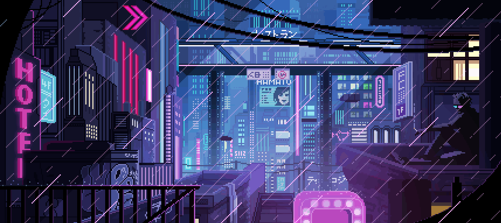

<!-- Juan Esteban Velandia Beltrán | Cyberpunk 2077 Themed GitHub Profile -->

  

<h1 align="center">⚡ Juan Esteban Velandia Beltrán ⚡</h1>
<h3 align="center">"Todo ya existe, solo hay que descubrirlo"</h3>

---

## 🧠 About Me

👾 Apasionado por el desarrollo, el diseño y la tecnología.  
🎮 Soñando con convertirme en **desarrollador de videojuegos**.  
🧩 Buscando fusionar lógica, creatividad y estética digital.  

> *Entre el código y el neón, descubro un nuevo camino cada día.*

---

## 💾 Tech Status

> **SYSTEM LOG: LEARNING PROGRESS**  
> 🐍 Python → Nivel básico  
> 🎨 HTML / CSS → Nivel bueno  
> ⚙️ GitHub → Nivel avanzado  
> 🕹️ JavaScript → Nivel básico  
> 🧬 MongoDB → Nivel bueno  
> ⚡ Node.js → En progreso  

> **STATUS: EVOLVING DEVELOPER**

  <a href="https://github.com/RyuMitsuky/Proyecto_Python_VelandiaJuan" target="_blank">
    <button class="cyberpunk2077 yellow">Python_</button>
  </a>

  <a href="https://github.com/RyuMitsuky/PROYECTO-FILTRO_VelandiaJuan_CarrilloDavid" target="_blank">
    <button class="cyberpunk2077 green">HTML + CSS_</button>
  </a>

  <a href="https://github.com/GustavoAdolfoNavarroPacheco/PROYECTO-FILTRO_NavarroGustavo_VelandiaJuan" target="_blank">
    <button class="cyberpunk2077 blue">JavaScript_</button>
  </a>

---
---

## 🔮 GitHub Stats

  
  

---

## 🌐 Contacto

  
  
  

---

  “El futuro pertenece a quienes pueden imaginarlo en código.”

  

  
  
  
  
  
  

  

  “El futuro pertenece a quienes pueden imaginarlo en código.”

