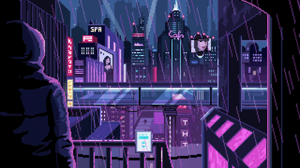

<!-- Juan Esteban Velandia Beltrán | Cyberpunk 2077 Themed GitHub Profile -->

  

<h1 align="center">⚡ Juan Esteban Velandia Beltrán ⚡</h1>
<h3 align="center">"Todo ya existe, solo hay que descubrirlo"</h3>

---

## 🧠 About Me

👾 Apasionado por el desarrollo, el diseño y la tecnología.  
🎮 Soñando con convertirme en **desarrollador de videojuegos**.  
🧩 Buscando fusionar lógica, creatividad y estética digital.  

> *Entre el código y el neón, descubro un nuevo camino cada día.*

---

<table>
  <tr>
  <tr>
    <td width="80" align="center" valign="middle">
      
    </td>
    <td align="left" valign="middle">
 

**💾 Tech Status**  
**SYSTEM LOG: LEARNING PROGRESS**  
🐍 Python → Nivel básico  
🎨 HTML / CSS → Nivel Intermedio  
⚙️ GitHub → Nivel avanzado  
🕹️ JavaScript → Nivel básico  
🧬 MongoDB → Nivel Intermedio  

## Actualmente Aprendiendo

## 🔮 GitHub Stats

  
  

---

  “El futuro pertenece a quienes pueden imaginarlo en código..”

  

  “El futuro pertenece a quienes pueden imaginarlo en código.”

